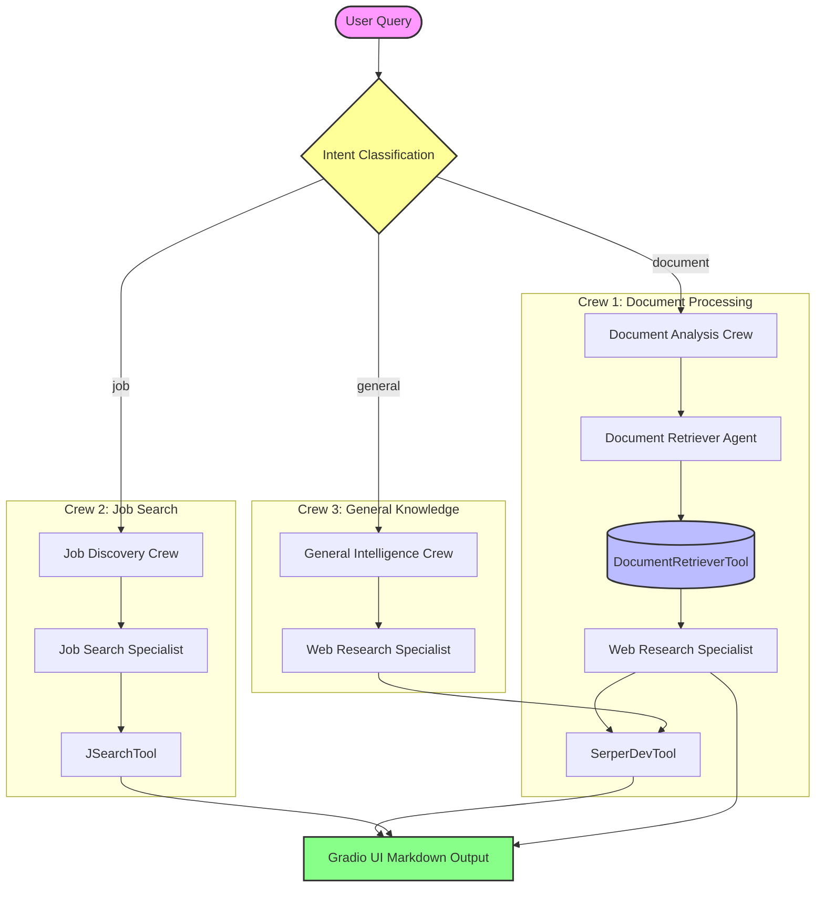

# 📚 Adaptive RAG & Multi-Agent Assistant

An intelligent, interactive multi-agent assistant built with **CrewAI**, **Gradio**, and **Groq** (`llama-3.3-70b-versatile`). The system employs an advanced architecture utilizing **Adaptive RAG**, automated **Intent Routing**, and dynamic **Tool Calling** to answer document queries, search the web, or extract live job market analytics.

🔗 **[Live Demo on Hugging Face Spaces](https://huggingface.co/spaces/Ruthwursun/MultiAgentRag_chatbot)**

---

## 🤖 System Architecture & Orchestration

The application processes user queries through a **Conditional Router** powered by LLM-driven zero-shot classification. Depending on the detected intent, it instantiates one of three isolated multi-agent workflows:



1. **Document Analysis Crew (`"document"`)**: 
   - **Document Retriever Agent**: Conducts localized semantic vector searches via a custom `DocumentRetrieverTool` on `RagNotes.pdf`. 
   - **Web Research Specialist**: Evaluates context completeness sequentially. If the document database lacks sufficient depth, it fires the `SerperDevTool` to cross-reference live web sources and explicitly attributes the final output by data origin.
2. **Job Discovery Crew (`"job"`)**:
   - **Job Search Specialist**: Translates raw developer backgrounds or local parameters into optimized search arguments via a tailored `JSearchTool` utilizing Google for Jobs data payloads.
3. **General Intelligence Crew (`"general"`)**:
   - **Web Research Specialist**: Directly leverages Google search capabilities to synthesize real-time, current global updates with complete URL citation tracking.

---

## 🛠️ Tech Stack & Key Paradigms

- **Multi-Agent Orchestration Framework**: CrewAI
- **Core LLM Engine**: Groq Cloud Engine (`llama-3.3-70b-versatile`)
- **Vector Search Engine**: ChromaDB
- **Embedding Transformer Models**: Hugging Face `sentence-transformers/all-mpnet-base-v2`
- **UI Framework Layer**: Gradio
- **Data Chunking Strategy**: LangChain `RecursiveCharacterTextSplitter` (chunk_size: 100, overlap: 0)

---

## 🚀 Local Installation & Setup

To run this application on your local workstation, execute the following steps:

### 1. Clone the Repository
```bash
git clone https://github.com/YOUR_GITHUB_USERNAME/YOUR_REPO_NAME.git
cd YOUR_REPO_NAME
```

### 2. Install Project Dependencies
Ensure you have a Python 3.10+ environment active, then run:
```bash
pip install -r requirements.txt
```

### 3. Configure API Credentials
Create a script or set your environment variables directly in your shell configuration:
```bash
export Groq_api_key="your-groq-api-key"
export SERPER_API_KEY="your-google-serper-api-key"
export RAPIDAPI_KEY="your-rapidapi-jsearch-key"
```

### 4. Provide Local Data
Place your target PDF document into the root folder exactly under the name `RagNotes.pdf`. The local embedding index pipeline will build and persist automatically inside `./chroma_db` at boot time.

### 5. Start the Application Interface
```bash
python app.py
```
Open the generated local URL (usually `[http://127.0.0.1:7860](http://127.0.0.1:7860)`) in your browser to interact with the system.
